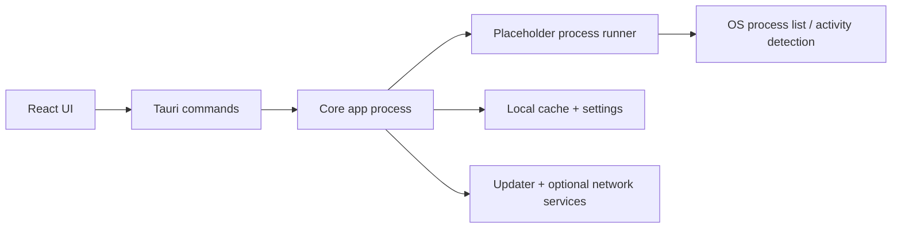

<div align="center">


# Disactivity

**Game activity simulator for desktop** — simulate play status and rich presence with a lightweight, open-source app built on **Tauri 2** and **React**.

Disactivity helps you show "Playing" status in social apps by running detectable placeholder game processes (no full game install required).

[](https://github.com/heza-ru/disactivity/releases)
[](https://github.com/heza-ru/disactivity/actions/workflows/build.yml)
[](https://github.com/heza-ru/disactivity/releases)
[](https://github.com/heza-ru/disactivity/commits)
[](LICENSE)
[](https://tauri.app/)
[](https://react.dev/)
[](https://bun.sh/)
[](https://github.com/heza-ru/disactivity/releases)

`v0.1.0-1` · *Version in this repository ([`package.json`](package.json) / [`src-tauri/tauri.conf.json`](src-tauri/tauri.conf.json)). **MSI/NSIS** bundles require a **numeric-only** prerelease (e.g. `0.1.0-1`, not `0.1.0-alpha`). **GitHub Releases** for this fork are the source of truth for installable builds here.*


<p>
  <a href="https://github.com/heza-ru/disactivity/releases/latest"><strong>Download Latest</strong></a>
  ·
  <a href="#features"><strong>View Features</strong></a>
  ·
  <a href="#developers"><strong>Build from Source</strong></a>
  ·
  <a href="CHANGELOG.md"><strong>Changelog</strong></a>
</p>

</div>

> **Independent fork**  
> This repository is **actively maintained on its own** — it is **not** a mirror of upstream release tags, issues, or roadmap. Installers, version numbers, and **Releases** published **here** apply to **this** project. For the original application and its author, see [Credits](#credits).

---

## Table of contents

- [Why this fork](#why-this-fork)
- [Feature comparison with the parent repo](#feature-comparison-with-the-parent-repo)
- [Features](#features)
- [Use cases](#use-cases)
- [Search terms](#search-terms)
- [Demo](#demo)
- [Quick start (30 seconds)](#quick-start-30-seconds)
- [Screenshots](#screenshots)
- [Download](#download)
- [How it works](#how-it-works)
- [Architecture at a glance](#architecture-at-a-glance)
- [FAQ / Troubleshooting](#faq--troubleshooting)
- [Developers](#developers)
- [Project structure](#project-structure)
- [Privacy & safety](#privacy--safety)
- [License](#license)
- [Contributing](#contributing)
- [Credits](#credits)

---

## Why this fork

[holasoyender/disactivity](https://github.com/holasoyender/disactivity) is the **parent** project. **This** repo is a **separate line of development**: own commits, own releases, and behavior that may **diverge** as features and refactors land here first (or only here). Use **this** project’s [Releases](https://github.com/heza-ru/disactivity/releases) for builds that match the code in this tree — not the parent’s release page.

---

## Feature comparison with the parent repo

Scope: comparison is based on this fork's current code and the parent repo README on `master` at the time of writing.

| Feature area | This fork (`heza-ru/disactivity`) | Parent (`holasoyender/disactivity`) |
|------|------------------------|-------------------------------|
| **Release channel** | Independent [Releases](https://github.com/heza-ru/disactivity/releases), fork-specific versioning and updater channel. | Upstream [Releases](https://github.com/holasoyender/disactivity/releases) and tags. |
| **Core simulation** | Simulate game activity by spawning placeholder executable processes. | Simulate game activity by spawning placeholder executable processes. |
| **Game catalog + search** | Detectable-games catalog with caching/refresh, debounced search, favorites, recent strip, large-list pagination + jump. | Detectable-games catalog, search, and favorites. |
| **Large library performance** | Virtualized long lists via [TanStack Virtual](https://tanstack.com/virtual), split i18n loading, and idle-deferred startup work. | Not documented upstream. |
| **Multiple concurrent games** | Supported (run/stop multiple games with shared controls). | Not documented upstream. |
| **Auto-stop + idle stop** | Configurable timed auto-stop and optional idle-based stop logic. | Not documented upstream. |
| **Remote/mobile page** | Included in this fork's product surface. | Not documented upstream. |
| **In-app updater status** | Wired to this fork's signed `latest.json` release artifacts. | Updater listed as WIP in upstream README. |
| **Languages** | English + Spanish (with async locale loading strategy). | English + Spanish. |
| **Startup settings IPC** | Batched Tauri `apply_startup_ui_settings` command for startup UI/settings sync. | Not documented upstream. |
| **Build tooling extras** | `bun run build:analyze`, `bun run build:no-compiler`, Vitest test setup in this tree. | Standard build flow documented in upstream README. |

If you need exact parity with the original app, use the [parent repository](https://github.com/holasoyender/disactivity) and its releases.

---

## Features

**Library & search**

- Game catalogue from a public detectable-games source; list cached and refreshable
- **Live search** (name, ID, aliases) with **debounced** filtering
- **Favorites** at the top; **virtualized** lists for large libraries; pagination + page jump
- **Recently played** quick strip; **import/export** favorites (JSON)
- **Game details** (aliases, executables, rich metadata when configured)

**Simulation**

- Multiple games at once, per-game timers and **title-bar** “running games” control
- Optional **executable** choice when a title exposes more than one Win32 binary
- **Auto-stop** after a configurable duration; **idle**-based auto-stop (when enabled)

**App shell**

- **System tray** behavior, in-app **updater**, **dark / light** theme, **i18n** (e.g. en-US, es-ES)
- **Remote** page (phone/tablet on the same network) and other product pages as shipped in this fork

**Developer experience (this tree)**

- TypeScript, Vite, Tauri 2, Rust, Bun; tests via Vitest

---

## Use cases

- Show "Playing" status for demos, streams, screenshots, or profile customization
- Test rich-presence detection behavior without installing every game locally
- Quickly switch simulated games for QA, UI captures, or community/testing workflows

---

## Search terms

People often look for this app using terms like:

- game activity simulator
- game presence simulator
- rich presence simulator
- fake game process helper
- show playing status
- Disactivity fork (`heza-ru/disactivity`)

If you searched for any of the phrases above, this fork is the independently maintained desktop app version.

---

## Demo

> Add a short product demo for better conversion and shareability.
>
> Suggested file: `docs/demo.gif` (10-20 seconds, under ~8 MB).

<p align="center">
  
</p>

---

## Quick start (30 seconds)

```bash
git clone https://github.com/heza-ru/disactivity.git
cd disactivity
bun install && bun run tauri dev
```

For production builds and full setup details, see [Developers](#developers).

---

## Screenshots

<p align="center">
  
</p>

---

## Download

**Get builds from this fork only:**

[](https://github.com/heza-ru/disactivity/releases)

→ **[Latest release (this repo)](https://github.com/heza-ru/disactivity/releases/latest)**

**What a release usually includes (like the [parent’s](https://github.com/holasoyender/disactivity/releases) style):** versioned **Windows installers** (NSIS + MSI from CI), Tauri **updater** assets (`latest.json` plus Minisign signature files next to the bundles for in-app updates), and **per-OS** desktop builds from the matrix (macOS / Linux) when the [Build & Release](.github/workflows/build.yml) tag workflow finishes. [CHANGELOG](CHANGELOG.md) and the GitHub **Release** description list what shipped for each tag.

*The parent project’s [releases](https://github.com/holasoyender/disactivity/releases) are a **different** channel — our in-app updater points at **this** repo’s `latest.json` only. Use the parent if you want upstream’s artifacts and update channel.*

---

## How it works

1. The app **loads a catalogue** of games and caches it locally.
2. You **Run** a game: a small placeholder process (`slave.exe` on Windows) is spawned so monitoring software can **detect the right executable name** — no full game install required.
3. You **Stop** manually, via auto-stop, or from global controls; temp artifacts are cleaned up.
4. Optional: **tray** minimize, **updater** checks, **remote** and **metadata** when you configure API keys (see in-app **Settings**).

*Technical details (cache TTL, process lifecycle, etc.) are implementation details — read the code and in-app help for the exact build you run.*

---

## Architecture at a glance



---

## FAQ / Troubleshooting

### "Playing" status does not appear

- Verify the desktop client is running and account visibility/privacy settings allow activity display.
- Start one title first, wait a few seconds, then test with another.
- Restart the desktop client after changing activity-related settings.

### Game list is missing or outdated

- Refresh the catalogue from the app and check your network connection.
- If cache looks stale, restart the app and retry refresh.

### In-app updater is not finding updates

- This fork uses its own release channel and signed `latest.json` artifacts.
- Confirm you installed a build from this fork's Releases page, not the parent repo.

### Build or installer gets blocked on Windows

- Smart App Control / reputation filters can flag unsigned or freshly built binaries.
- Use trusted local build paths, and sign release artifacts for distribution builds.

### `slave.exe` behavior looks wrong

- Rebuild the helper binary before full builds:
  - `cd src-tauri/slave`
  - `cargo build --release`
  - `cd ../..`

---

## Developers

### Prerequisites

- [Bun](https://bun.sh/)
- [Rust](https://www.rust-lang.org/tools/install) (stable) + Windows `msvc` toolchain for Windows builds
- Tauri 2 [requirements](https://v2.tauri.app/start/prerequisites/) for your OS

### Quick start

```bash
# clone this fork (not the parent) if you want this codebase
git clone https://github.com/heza-ru/disactivity.git
cd disactivity

bun install

# Build the embedded Windows slave binary before full Tauri build
cd src-tauri/slave
cargo build --release
cd ../..

# Dev
bun run tauri dev

# Production bundle (output under src-tauri/target/.../bundle/)
bun run tauri:build
```

| Script | Use |
|--------|-----|
| `bun run dev` / `bun run tauri dev` | Vite + Tauri dev |
| `bun run build` | Web build only |
| `bun run tauri:build` | App installer / bundle |
| `bun run build:analyze` | `dist/stats.html` chunk treemap |
| `bun run test` | Vitest |

### Tech stack (current)

- **UI:** React 19, Vite, Tailwind CSS, Radix primitives
- **Desktop:** Tauri 2, Rust
- **Package manager:** Bun

---

## Project structure (abbrev.)

```
.
├── public/                 # Static assets, icons
├── src/                    # React + TypeScript frontend
│   ├── components/         # UI, game list, title bar, …
│   ├── pages/              # Home, settings, about, remote, …
│   ├── i18n/locales/      # en-US, es-ES, …
│   └── lib/                # settings, schedulers, utilities
├── src-tauri/              # Rust, Tauri commands, bundling
│   ├── src/                # e.g. lib.rs, feature modules
│   └── slave/              # Windows placeholder process
└── scripts/                # build helpers
```

---

## Privacy & safety

- **No built-in telemetry** in this project’s source as shipped here — review releases yourself.
- **Network** use is for catalogue/metadata/updater and **optional** services you enable (e.g. API keys).
- Placeholder binaries use **temp** storage where applicable; see code for your platform.

---

## License

**MIT** — see [`LICENSE`](LICENSE).  
Upstream and this fork are both open source; **compliance and attribution** remain your responsibility for how you use and redistribute builds.

---

## Contributing

- **Issues & PRs** for this line of work should target **[this repository](https://github.com/heza-ru/disactivity)**, not the parent, unless you intend to contribute **upstream** there.
- For **large** changes, open an issue first.
- Starring the repo helps visibility — on **this** fork if you use this code.

---

## Credits

| | |
|---|---|
| **Original project** | **Disactivity** by **[holasoyender](https://github.com/holasoyender)** — [github.com/holasoyender/disactivity](https://github.com/holasoyender/disactivity) |
| **This fork** | Maintained separately: **[heza-ru/disactivity](https://github.com/heza-ru/disactivity)** (releases & issues here). |

Original app concept, branding lineage, and prior art belong to the **parent** project and its **original creator** above. This README’s **version** and **release** references apply to **this** fork only.

---

<p align="center">
  <a href="https://star-history.com/#holasoyender/disactivity&Date">
    
  </a>
  <br />
  <sub>Star history: <strong>original</strong> <code>holasoyender/disactivity</code> (reference). Star <a href="https://github.com/heza-ru/disactivity">this fork</a> to support <strong>this</strong> line of development.</sub>
</p>
